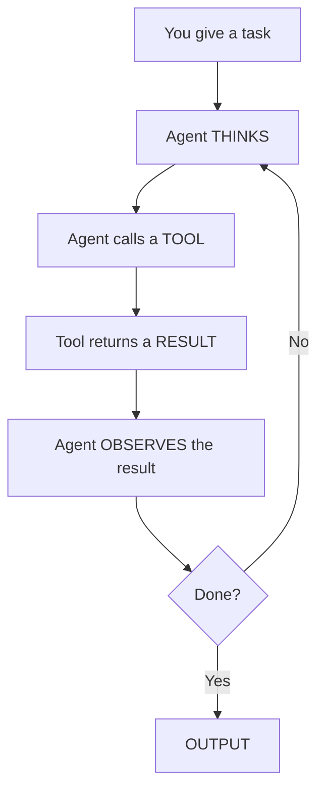

**Estimated time: ~1 hour**


**What you will learn in this module:**

- What a coding agent is and how it differs from autocomplete and chat assistants
- The current landscape of tools, models, and 
- How , , , and  affect both cost and output quality
- How the agent sees your codebase, navigates files, and takes real actions through 
- Working safely with git, the common problems every team hits early, and how to recover
- Data privacy, where your code is sent, and real-world cost breakdowns
- , , , and session workflow that turn a generic agent into one that knows your team's conventions


---

## The Core Mental Model

In traditional engineering, you write the code, but in agentic engineering, you describe what you want, the agent writes it, and your job becomes reviewing, correcting, and steering the output toward the right result. You build up rules, conventions, and reusable  over time so that every future session is faster and more accurate than the last.

### Your Role Is Director

This is a genuine change in how you work. You are no longer the one who types the solution. You are the one who defines the problem clearly, points the agent at the right files and context, reviews everything it produces, and corrects it when it goes wrong. The agent is fast and capable but has no judgment about what you actually want. __That judgment is yours to provide.__

The biggest mistake teams make early on is treating the agent like a better Stack Overflow, pasting in a question and copying out the answer. A coding agent can read your entire codebase, run tests, execute commands, and modify files across your project. It can take a task from start to finish without you intervening at every step, but only if you learn to direct it well. That takes .

### Choosing the Right Tasks

Knowing what to delegate matters as much as how you delegate it. The best tasks are well-scoped, easy to verify, and do not require judgment calls that go beyond the code itself. Product decisions, trade-offs that depend on context only your team has, or anything where "done" is hard to define upfront should stay with you. A useful test is whether you can write a short spec for what you want. If you cannot, the task is not ready to delegate. Clarify first, then hand it off.

### Review Everything

Treat every piece of output the agent produces as __a draft, not a commit.__ The agent does not flag its own limitations. It will write code that compiles, passes tests, and looks right while quietly misunderstanding what you actually needed. Your job after every task is to read the diff, run the tests, and verify the behavior rather than accepting output just because it looks plausible. Think of it like reviewing a pull request from someone who is fast, confident, and occasionally wrong in ways that are hard to spot.

---

## What Is a Coding Agent?

__A coding agent is an LLM that can read your codebase, plan changes across multiple files, execute code and run tests through the terminal, and iterate on its own mistakes when something goes wrong.__ Unlike autocomplete tools that predict the next line, and unlike chat interfaces where you ask a question and get a text answer, a coding agent operates in a  where it thinks about what to do, takes an action, observes the result, and adjusts its approach until the task is complete or it needs your input.

The distinction is between a coding *assistant* and a coding *agent*. An assistant answers when asked. An agent takes action autonomously within a defined scope. It reads files, writes code, runs terminal commands, searches your codebase, and chains multiple steps together without you intervening at each step.

**The spectrum of autonomy:**

<table>
<thead><tr><th>Level</th><th>Behavior</th></tr></thead>
<tbody>
<tr><td>Manual Coding</td><td>You write everything</td></tr>
<tr><td>Autocomplete</td><td>It suggests the next line</td></tr>
<tr><td>Chat Assistant</td><td>It answers when asked</td></tr>
<tr style="background-color: rgba(236, 67, 0, 0.12); font-weight: 600;"><td>Coding Agent</td><td>It does what you define</td></tr>
<tr><td>Fully Autonomous</td><td>It decides + does (not reliably here yet)</td></tr>
</tbody>
</table>

Most teams today sit somewhere between "autocomplete" and "chat assistant." This guide moves you to "coding agent."

---

## Harnesses, Models, and How to Choose

When teams first start working with coding agents, they often treat the **harness** and the **model** as interchangeable. The harness is the environment your agent runs inside, covering the shell, the editor, and the file system access, while the model is the AI doing the actual reasoning. Choosing them independently, and knowing when to swap either one, is a core part of using agents well.

### Harnesses

A **harness** is the environment the agent runs inside, encompassing the shell, editor integration, file system access, terminal, and UI.

| Type | Examples | Description |
|------|----------|-------------|
| Terminal native | Claude Code, Aider, Codex CLI, Gemini CLI | Run directly in your terminal with full filesystem and shell access |
| AI native IDEs | Cursor, Windsurf, Zed | Full code editors rebuilt around AI |
| IDE extensions | Cline, Roo Code, GitHub Copilot, Continue | Plug into existing editors like VS Code or JetBrains |
| Cloud/autonomous | Devin, OpenHands, Manus, Codegen | Run in their own cloud environment |
| Spec driven | Kiro (AWS) | Structure work around specifications first |
| Automated pipeline | Factory | Automated code generation pipelines |
| IDE extension | Kilo Code | Lightweight agent for rapid prototyping |

### Models

A **model** is the AI doing the actual reasoning and code generation inside the harness. It reads your prompt and context, decides what actions to take, and produces the output you review. Different models have meaningfully different strengths. Some are better at complex multi-step reasoning, others are faster and cheaper for routine work, and some can be self-hosted if your security posture requires it.

| Model | Strengths | Approx. API Pricing (per 1M tokens) |
|-------|-----------|--------------------------------------|
| Claude Opus 4.6 | Best reasoning, ~80% SWE-bench, 1M context | $5 / $25 |
| Claude Sonnet 4.6 | Strong coding at lower cost | $3 / $15 |
| GPT 5.3 Codex | Fast, polyglot, strong terminal scores | $1.25 / $10 |
| Gemini 2.5 Pro | Large context, strong at code understanding | Varies |
| DeepSeek R1 | Open weight reasoning, self-hostable | Self hosted or API |
| Qwen 3.5 | Open weight, cost efficient | Self hosted or API |
| Llama 4 Code | Open weight, runs locally | Self hosted |
| MiniMax Text-01 | 1M context, strong at long-context tasks | API |
| GLM-4 (Zhipu) | Open weight, strong multilingual coding | Self hosted or API |

The choice of harness depends on how your team works today (terminal people vs IDE people), your security requirements, and how much autonomy you want to give the agent. The choice of model depends on the complexity of your tasks, your budget, and whether you need self-hosted deployment. In practice, many developers in 2026 use a combination of both. They might use an IDE like Cursor for daily coding alongside a terminal agent like Claude Code for complex refactors and architectural work.

### Understanding Model Numbers

When a new model is announced, the numbers you will see most often are parameter count and training token count. Parameters are the internal numerical weights the model learned during training, representing billions of tiny adjustments made while processing vast amounts of text, code, and data. More parameters generally mean more capacity to handle complexity. Training tokens are how much text the model read before it was released. For example, when a model is described as "70 billion parameters trained on 15 trillion tokens," it means a medium-large model trained on a very large corpus, though neither number tells you how well it codes.

A well-optimised smaller model can outperform a larger one trained carelessly. What actually matters for your work is **benchmark performance on coding tasks**, **context window size**, and **cost per token**, all of which are in the table above.

---

## Reasoning vs Standard Models

Models differ in capability and in how they arrive at an answer. Some generate output directly and quickly; others work through a structured thinking process before responding. This difference is significant when choosing a model for a given task.

**Standard models** like Claude Sonnet 4.6, GPT 5.3 Codex, and open-weight models like Qwen 3.5 generate responses token by token from left to right. They are fast, good for straightforward tasks, and cost efficient.

**Reasoning models** like Claude Opus 4.6 with extended thinking, DeepSeek R1, and o3 have an explicit "thinking" phase where they plan, consider alternatives, backtrack, and self-correct *before* producing output. This takes more tokens and more time, but the results on complex tasks are noticeably better.

### When to Use Which

| Task Type | Model Type | Why |
|-----------|-----------|-----|
| Routine code generation, simple fixes, boilerplate | Standard | Faster, cheaper, sufficient quality |
| Complex logic, multi-step reasoning, debugging | Reasoning | Upfront thinking cost pays off in fewer iterations |

Most harnesses let you switch models mid-session. A good practice is to start planning with a reasoning model since it handles ambiguity and architectural decisions better, then switch to a faster standard model like Sonnet to execute the concrete implementation once the plan is clear.

---

## Tokens: The Currency You're Spending

Every interaction with an agent costs **tokens**.

For English prose, roughly 4 characters equal 1 token, but code tokenizes less efficiently because special characters (`{`, `}`, `=>`, `//`), indentation, and camelCase variable names all consume more tokens per line than plain text. A line of English runs about 7–10 tokens; a line of Python or JavaScript runs about 10–15 tokens.

### The Token Economy

- **Context window** is how much the agent can "see" at once, ranging from 128K to 1M tokens. A bigger window means more awareness but also more cost per request.
- **Input tokens** are what you send (code, instructions, file contents) and make up the bulk of cost.
- **Output tokens** are what the agent generates. The volume is smaller but output is typically 3–5x more expensive per token than input.
- **Reasoning tokens** are generated during the "thinking" phase and you pay for them even if you never see them. This is the hidden cost that catches teams off guard when they first switch to reasoning models.


A 30-minute coding session can easily consume 500K–1M+ tokens. The daily cost per developer depends heavily on which model you use. Frontier reasoning models are significantly more expensive than standard or open-weight alternatives. Know your burn rate.


### Context Compaction

When a session approaches the model's context limit, the harness automatically summarizes and compresses the conversation history. In Claude Code and OpenCode, you can also trigger this manually with a `/compact` command when you want to start a cleaner session without losing your progress.

Compaction is lossy by design. The summary preserves the broad shape of what was discussed but drops fine-grained details like exact file paths, specific error messages, and verbatim snippets. This is why shorter, focused sessions produce better output than long sprawling ones. If the agent has already compacted once and output quality still seems off, starting a fresh session with a clean context and a precise summary is almost always the faster path.

---

## Prompt Caching

When you send a request, a large chunk of the context is identical every time. Your skills, rules file, repo structure, and working files don't change between requests within a session.

**Prompt caching** means the provider stores this static prefix so you don't pay full price on every request.

### How it works

1. First request sends everything at full price
2. Subsequent requests with the same prefix hit the cache (10–90% discount)
3. Cache has a TTL, so long pauses between requests may invalidate it

### Practical implications

- **Front-load static context** by putting skills and system instructions at the beginning and variable task instructions at the end. This maximizes cache hits across sequential requests.
- **Keep sessions warm.** Rapid back-and-forth keeps the cache alive, while long pauses may invalidate it and cost you more.
- **Skills and rules files pay for themselves.** They sit in the cached prefix and are nearly free after the first request, so the quality improvement comes at almost no marginal cost.
- **Most modern harnesses handle caching automatically** (Claude Code, Cursor, and others), but understanding the mechanic helps you structure sessions for maximum efficiency.


Teams that understand caching and structure their workflows around it can reduce their token spend by 40–60%.


---

## How the Agent Sees Your Codebase

A coding agent does **not** have your entire repo loaded in memory. The context window is large but finite, so the agent must be selective.

### What happens when you give a task

1. The harness **indexes your repo**, building a file tree and sometimes generating embeddings so the agent can search efficiently
2. The agent **decides which files are relevant** based on filename, import chains, codebase search, or your explicit guidance in the prompt
3. Selected files get **loaded into the context window** alongside your prompt, rules, and skills
4. The agent works with **only what is in the window**. Everything outside effectively does not exist

### Consequences

- If the agent does not load the right file, it will  plausible but incorrect code, or produce something that works in isolation but conflicts with the rest of your codebase
- **Explicit file references** in your prompts like "read `src/api/auth.ts` and `src/types/user.ts` before making changes" dramatically improve accuracy
- Large monorepos are inherently harder for agents to navigate than well-structured smaller codebases, and your project organization directly affects how effective the agent can be
- Catching conflicts with unloaded files is **your responsibility** during review

---

## Tool Use: How Agents Do Things

An agent is *acting* on your system: reading files, running commands, writing code, and modifying your project. Knowing the tool use loop takes the mystery out of what the agent is doing when you watch it work.

### The agentic loop



### Common tools

| Tool | Purpose |
|------|---------|
| File read | Load file contents into context |
| File write/edit | Create or modify files |
| Terminal/bash | Run commands, tests, git operations |
| Search/grep | Find patterns and definitions across the codebase |
| Web fetch | Pull documentation or external information |
| MCP tools | Connect to external services via  |

### In practice

- Each tool call costs tokens because both the request and the response consume context window space. An agent that makes 20 file reads before writing a single line of code is spending your context budget
- You can steer efficiency directly through your prompts. Asking the agent to "read `auth.ts` and `types.ts`, then implement the change" is both cheaper and faster than "figure out which files are relevant"
- Once you understand the tool use loop, you can *read* what the agent is doing as it works, which helps you decide when to let it run and when to interrupt


Each tool call costs tokens. Being explicit about which files to read saves both time and money.


---

## Working with Git

Before running your first agent session, establish one non-negotiable habit. Treat git as your undo button. An agent can modify dozens of files in the time it takes you to read its plan. Without checkpoints, recovering from a bad run means manually untangling changes across your entire codebase.

### The three rules

1. **Always work on a branch.** Never run an agent session directly on `main`. Create a branch before every session by running `git checkout -b agent/feature-name` before the agent touches anything. If the output is wrong, `git checkout main` and you are back to a clean state in one command.
2. **Commit before you start.** Make sure your working tree is clean before the first task. If the agent produces good output halfway through and then goes off the rails, a clean starting commit means you can cherry-pick the good changes and discard the rest.
3. **Use `git diff` as your primary review tool.** Review the diff before running tests. The diff shows what the agent actually did; treat its prose summary as a starting point, not a substitute.

### Commit checkpoints during long sessions

For tasks that span many files, ask the agent to commit at logical milestones:

> "Implement the auth handler, commit, then move on to the tests"

This creates granular history you can step through with `git log --oneline` and roll back to any checkpoint if the next step goes wrong.

### Git worktrees for parallel work

Once you are comfortable with single-agent sessions,  let you run multiple agents in parallel on the same codebase without conflicts. Each worktree is a separate directory checked out on its own branch, but all sharing the same `.git` history. You can have one agent refactoring the auth module while another writes tests, with no risk of overwriting each other.

```bash
git worktree add ../project-feature-name feature/feature-name
```

As of early 2026, git worktrees have emerged as the standard isolation mechanism for teams running parallel agent workflows.

---

## When Things Go Wrong

Every team runs into the same problems early. Recognising them quickly is what separates an hour lost from five minutes lost.

### The agent modifies things you didn't ask it to

The agent begins with your task and somewhere mid-session decides to "improve" something adjacent. It reformats files you didn't mention, refactors a utility function, or installs a dependency without asking. The output compiles, tests pass, but the diff is three times larger than it should be.

Most harnesses show you the agent's plan before it executes. If the file list includes things you didn't ask about, interrupt and tighten the scope. Add explicit constraints telling the agent *"Only modify files in `src/api/`. Do not change shared utilities or `package.json`."*

### The output looks right but isn't

Code can compile, pass tests, and look correct while still being logically broken. This happens most often when the agent didn't load the right files into context, made assumptions about an API it couldn't see, or referenced a function signature that doesn't exist.


Always run the **full** test suite, including tests the agent had no part in writing. The agent writes tests that validate its own output; correctness is your job to verify. Scan the diff for any function calls or imports that feel unfamiliar. These are the most common sites for invented code.


### The agent keeps trying the same thing

The agent gets stuck cycling through attempts. It tries something, gets an error, tries a variation, then gets the same error. This almost always means it is missing context it cannot find by searching your codebase.

If the agent has tried the same fix three or more times, **stop it**. Paste in the relevant file directly, the exact error message verbatim, and restart with a focused prompt. The agent cannot ask you for what it doesn't know it needs.

### Output quality drops over a long session

As a session grows long, the context window fills with back-and-forth conversation, intermediate results, and abandoned approaches. The agent starts ignoring earlier constraints or writing code that contradicts decisions from 30 messages ago.

If you've been in the same session for 45–60+ minutes and quality has dropped, start a fresh session with a clean context and a precise summary. It almost always produces better output than pushing through.

### When anything goes wrong

`git reset` or `git checkout` is faster than trying to surgically undo agent changes. Know your last clean commit, reset to it, and restart with a tighter prompt. The session history is not worth preserving if the codebase state is wrong.

---

## Where Your Code Goes

Your engineering leads and security team will ask about this first. Have the answer ready.

| Setup | Code leaves your machine? | Who sees it? |
|-------|--------------------------|--------------|
| API-based (Claude API, OpenAI API) | Yes | Provider processes it; most do NOT train on API data |
| IDE tools (Cursor, Windsurf, Cline) | Yes | Some route through their own servers first |
| Self-hosted open weight models | No | Only your team |
| Cloud agents (Devin, Manus) | Yes | Provider has access within their sandbox |

### Questions to answer before adopting any tool

- Does the provider train on API inputs, and is this different for free tier vs paid plans?
- Where are the provider's servers located, and does data residency matter for your organization?
- Is the data encrypted in transit and at rest?
- Can you use a self-hosted or VPC-deployed model if your security posture requires it?
- What happens to your code after the session ends? Is it logged, cached, or retained?
- Does the tool support BYOK (bring your own key)?

For most teams building non-classified software, API-based tools with a no-training-on-input policy are sufficient to get started. For regulated industries or teams with sensitive IP, self-hosted open weight models like DeepSeek R1, Qwen 3.5, or Llama 4 Code give you full control over data boundaries, though you take on infrastructure management and lower model quality.

---

## What This Actually Costs

### Rough cost ranges (March 2026)

| Usage Pattern | Estimated Daily Cost per Developer |
|--------------|-----------------------------------|
| Light use (a few tasks/day) | $2–$5 |
| Moderate use (agent-assisted for most work) | $5–$15 |
| Heavy use (continuous with large context) | $15–$40+ |

These assume frontier model API pricing. If you are on a subscription plan like Cursor ($20/month) or Claude Pro ($20/month), the cost structure is different but comes with usage limits and rate caps that heavy users hit regularly.

### What drives cost up

- Loading large files repeatedly instead of leveraging the cache
- Using reasoning models on simple tasks where a standard model would produce the same result
- Running long, unfocused sessions where the context grows without reaching resolution
- Multi-agent workflows multiplying token consumption

### What keeps cost down

- Writing precise prompts that minimize unnecessary exploration
- Using skills and rules files that frontload cached context
- Breaking large tasks into focused sessions
- Defaulting to standard models, escalating only when needed
- Knowing when to stop the agent and write the code yourself, because sometimes that is the most efficient path


If an agent saves a developer 2 hours/day at $75/hr fully loaded cost, that's $150/day recovered against $10–$20/day token spend. The math works, but only if the team uses agents well.


---

## Rules Files, Skills, and Codebase Readiness

This separates teams who get consistent output from teams who feel like the agent produces something different every time.

### Rules files

A rules file is a markdown document the agent reads automatically at the start of every session. It contains your project's conventions, coding standards, testing expectations, build commands, and anything else the agent needs to know to work effectively in your codebase.

| Tool | Rules File |
|------|-----------|
| Claude Code | `CLAUDE.md` |
| Codex | `AGENTS.md` |
| Cursor | `.cursor/rules/` |
| JetBrains Junie | `.junie/guidelines.md` |

As of late 2025, `AGENTS.md` has emerged as a universal standard under the Linux Foundation's Agentic AI Foundation, and most major tools now support it. If your team uses multiple coding agents, you can maintain one `AGENTS.md` as your source of truth and symlink it to the tool-specific filenames.

A good rules file should be concise (under 200 lines), contain only information the agent cannot infer from the code itself, and be treated as a living document that you update whenever the agent makes a mistake you don't want repeated. It is onboarding documentation for a team member who joins fresh every session.

### Skills

A skill is a more specific, task-scoped instruction set (`SKILL.md`) that the agent loads only when relevant. Rules files apply to every task. Skills activate selectively based on what you are doing. A skill for creating a new API endpoint would specify the folder structure, error handling pattern, and testing style. A skill for generating a PDF would specify which library to use and what steps to follow.

A prompt is a one-time instruction for a specific task. A skill is a persistent, reusable instruction that applies across many tasks. Prompts are directions to a specific destination. Skills are the driving rules the driver follows regardless of where they are going.

As of March 2026, there are community-maintained libraries with over a thousand portable skills that work across Claude Code, Cursor, Gemini CLI, Codex CLI, and other agents.

### Hooks

Rules files and skills are probabilistic. The agent follows them most of the time, but under pressure from long context or complex tasks it may skip instructions. Hooks provide **deterministic enforcement** through shell scripts that run automatically at specific points in the agent's workflow and always execute without exception. If you need a rule that is never violated, like "always run the linter before committing" or "never execute `rm -rf`", a hook is more reliable than a rules file entry.

### Your codebase affects agent performance

An important insight that teams often overlook is that agent quality is shaped by your prompting and by the state of your codebase in equal measure. Missing documentation, undocumented environment variables, build processes that require tribal knowledge, and absent linter configuration all make the agent's job harder.

A codebase that a new engineer could set up and run in 30 minutes is also a codebase where an agent performs reliably. Investing in your `AGENTS.md`, test coverage, and build tooling is both engineering hygiene and a direct multiplier on the leverage you get from every agent session.

---

## The Session Workflow

Every working session with an agent follows this rhythm:

| Step | Action |
|------|--------|
| 1. **FRAME** | Define the task in plain language, be specific about scope |
| 2. **ORIENT** | Point the agent at the right files, context, and skills |
| 3. **EXECUTE** | Let the agent work; observe its plan before it acts |
| 4. **VERIFY** | Review the output, run tests, check edge cases |
| 5. **STEER** | Correct course if needed, add constraints, iterate |

This loop applies whether you are fixing a one-line bug or building a full feature across multiple files and services.

### Your first session

Do not start with a large or ambiguous task. Pick something small, well-understood, and easy to verify. Try a bug you already know the fix for, a test file for a module you wrote yourself, or a small refactor in a section of the codebase you understand well.

The goal of the first session is to learn how the agent reads your codebase, how much context it loads before acting, and how to read its plan before it executes. A task where you already know the right answer is the best learning environment because you can evaluate its output against your own knowledge.


The first few sessions will feel slower than just writing the code yourself. That passes. By week 2–3 of consistent use, most engineers are moving faster with the agent than without, especially on tasks involving boilerplate, repetitive patterns, or multi-file coordination.


---

## Glossary

| Term | Definition |
|------|-----------|
| **Agent** | An LLM that can plan, execute, and iterate on coding tasks autonomously within a defined scope |
| **Harness** | The tool or environment the agent runs inside (Cursor, Claude Code, Aider, Devin) |
| **Rules file** | A markdown document (CLAUDE.md, AGENTS.md, .cursorrules) the agent reads automatically to learn your project's conventions |
| **AGENTS.md** | A universal, tool-agnostic rules file format supported by most major coding agents, stewarded by the Agentic AI Foundation |
| **Skill** | A reusable, task-scoped instruction set (SKILL.md) for a specific class of work |
| **Hook** | A deterministic shell script that runs at a specific point in the agent workflow, providing enforcement that rules files cannot guarantee |
| **Context compaction** | Automatic summarization when the context window approaches its limit, replacing detailed history with a compressed version |
| **Token** | The basic unit of text the model processes (~4 characters for prose, less efficient for code) |
| **Prompt caching** | Provider-side storage of repeated context prefixes that reduces cost on sequential requests |
| **Reasoning model** | A model with an explicit thinking phase (Claude Opus 4.6, DeepSeek R1, o3) |
| **Standard model** | A model that generates output directly (Claude Sonnet 4.6, GPT 5.3 Codex) |
| **Tool use** | How agents take real actions (reading files, running commands, searching code) |
| **MCP** | Model Context Protocol, an open standard (now under the Linux Foundation) for connecting agents to external tools |
| **Subagent** | A lightweight agent instance spawned to handle a subtask in parallel |
| **Agent team** | Multiple independent agent instances working together with inter-agent communication and coordinated execution |
| **Hallucination** | When the agent generates plausible but incorrect code or references nonexistent APIs |
| **Context degradation** | Gradual decline in output quality as sessions grow long |
| **Git worktree** | A linked working directory enabling multiple agents to work in parallel on separate branches |
| **Scope drift** | When an agent exceeds its defined task boundary, modifying files it was not asked to change |
